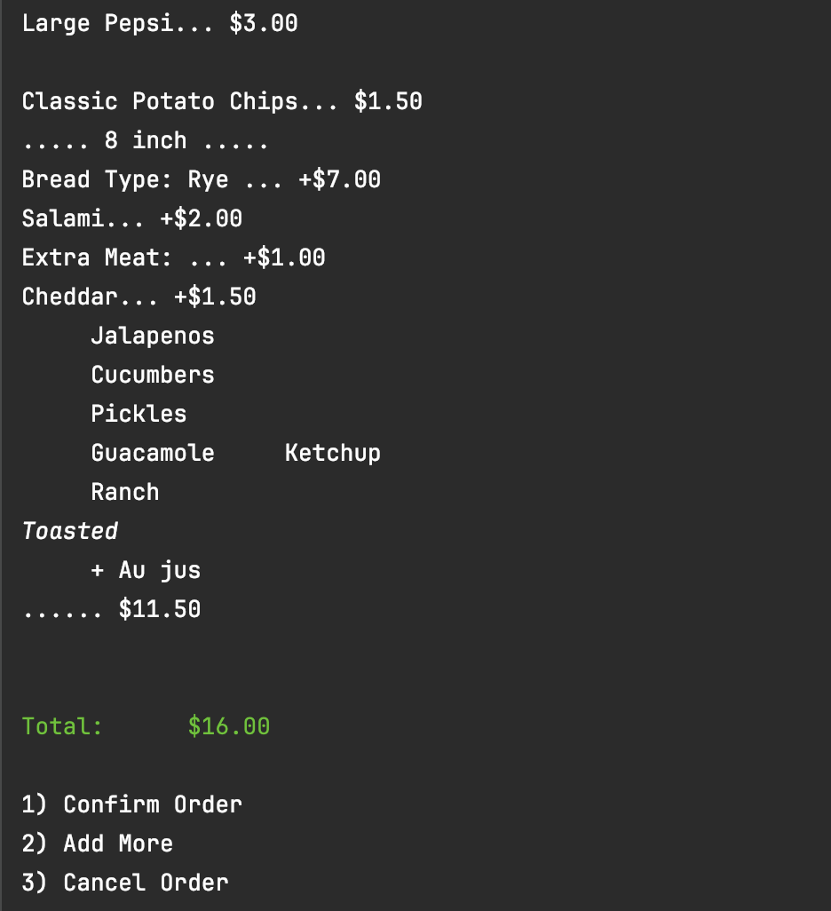

# Delicious Gourmet Deli App
This app is designed to take in an order. 
Through the `Create A New Order` screen, user can add a sandwich, drinks, or chips to their order. If adding a sandwich, they can customize it to add the toppings, size, and selections they want. They also have the ability to cancel their order/go back home, or checkout their order.
In the `Checkout` screen, user can view their current order and the order total. From here, they have the option to confirm the order, cancel the order, or add more items to the order.

### Home

> *From the home screen, user can start a new order or exit*

### Create An Order

>> Screen allows for user to add a new sandwich, chips, or a drink to their order.*

### Adding a Sandwich

>> *While adding a sandwich, the user will be prompted for extra meat and cheese only if they add meat or cheese to the order. User can also type out the name of the value or select the number assigned to it.*

>> *While creating a sandwich, if input is invalid, user will be prompted to try again.*

>> *User will be prompted for the toppings they want, allowing them to customize their sandwich.*

### Add A Drink

> *User can add a drink and select the size and flavor they want*

### Add Chips

> *User can add chips to an order.*

### Checkout

> *Screen allows for user to view the order and order total. From here, they can confirm the order which is saved to the receipt file, save their order, or add more items.*

### Project Summary

## Project Board

:bulb: **Interesting Piece of Code:** The static ANSI colors.

>> `public static final String RED = "\u001B[31m";
public static final String BRIGHT_WHITE = "\u001B[97m";
public static final String BRIGHT_GREEN = "\u001B[92m";`
>> *Used these Strings for formatting and color for the app*